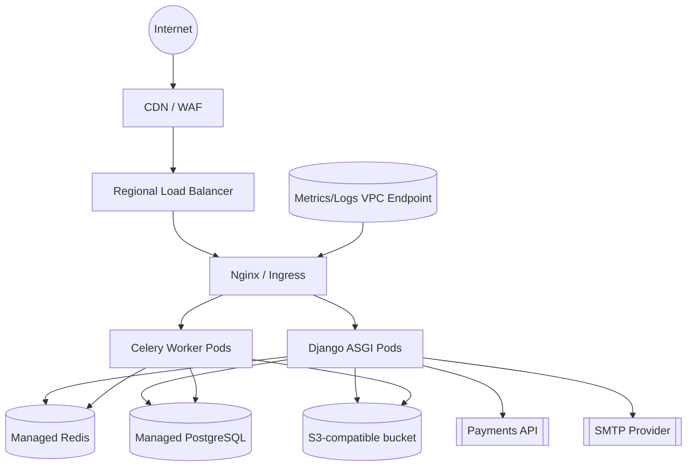

# Network Topology and Environments

## Environment overview

| Environment | Purpose | Git branch | Release cadence | Notes |
|-------------|---------|------------|-----------------|-------|
| Dev | shared integration sandbox for feature testing | `develop` | On merge | Auto deploy after CI success, allows feature flags and debug logging |
| Stage | pre-production validation, load and release rehearsals | `release/*` (latest) | Manual after Dev soak | Mirrors production data models, no debug flags |
| Prod | customer-facing system of record | `main` tagged releases | Manual, change-managed | Observability + SLO dashboards, break-glass only |

## Release policy

- **Dev**: every merge to `develop` triggers container rebuilds and deployment to Dev via GitOps.
- **Stage**: every time a release candidate branch `release/x.y.z` is cut from `develop`, it deploys to Stage after automated/regression checks succeed.
- **Prod**: only annotated git tags `vX.Y.Z` created from `main` trigger production deployments; tags are immutable and signed.

## Network topology

### VPC layout

| Component | CIDR / Notes |
|-----------|--------------|
| VPC | `10.60.0.0/16`, three AZs |
| Public subnets | `10.60.0.0/20`, `10.60.16.0/20`, `10.60.32.0/20` (Ingress + NAT GW) |
| Private app subnets | `10.60.64.0/20`, `10.60.80.0/20`, `10.60.96.0/20` (ASGI + Celery) |
| Data subnets | `10.60.128.0/24` per AZ (PostgreSQL, Redis) |
| Services subnets | `10.60.160.0/24` (bastion, observability agents) |

- NAT gateways sit in each public subnet; private subnets route through NAT only for outbound package updates.
- Managed PostgreSQL, Redis, and object storage expose **private endpoints** pinned to the data subnets; SGs restrict access to app/worker subnets only.
- Egress to payment and mail providers is allowed solely from public subnets via static egress IPs to satisfy whitelisting.

### Domain and certificates

| Environment | Domain(s) | Certificate authority | Renewal |
|-------------|-----------|------------------------|---------|
| Dev | `dev.api.example.com`, `dev.app.example.com` | ACM / Let's Encrypt staging | Auto via DNS challenge |
| Stage | `stage.api.example.com`, `stage.app.example.com` | ACM | Auto-renew, monitored |
| Prod | `api.example.com`, `app.example.com`, `www.example.com` | ACM issued via public CA | Auto-renew with 45-day alarm |

### Branch → Environment → Domains matrix

| Branch pattern | Environment | Domains |
|----------------|-------------|---------|
| `feature/*` | Ephemeral preview (optional) | `pr-<id>.dev.app.example.com` |
| `develop` | Dev | `dev.api.example.com`, `dev.app.example.com` |
| `release/*` | Stage | `stage.api.example.com`, `stage.app.example.com` |
| `main` tagged (`vX.Y.Z`) | Prod | `api.example.com`, `app.example.com`, `www.example.com` |

### Connectivity controls

- Security Groups only allow TCP/443 to Ingress from CDN/WAF; internal traffic between Ingress and services uses mutual TLS via service mesh (optional).
- Redis/PostgreSQL ports (6379, 5432) are open only to ASGI + Celery SGs.
- Object storage is accessed through VPC gateway endpoint; no public internet path.
- Payments/SMTP providers are reachable through static egress IPs with firewall rules ensuring origin subnets belong to `10.60.0.0/16`.

### Observability and SLO inputs

- Request/response metrics and logs are shipped via VPC endpoints to the monitoring account; no public egress required.
- SLI dashboards alert when error rate >1% over 5m in Prod or >5% in Stage.

