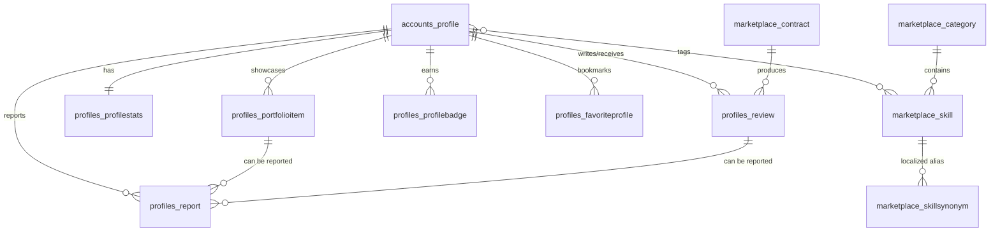

# Profile & Reputation ER Diagram

## Explanation

- **Profile ↔ Skill taxonomy** – a profile references many localized skills; categories create the navigation tree and synonyms enable multilingual search. This combination powers indexing by slug, category and synonym language.
- **ProfileStats** – one-to-one aggregate updated asynchronously (analytics pipeline). Contains sensitive engagement metrics used for ranking and eligibility.
- **PortfolioItem** – ordered case-study blocks (problem → solution → result) plus JSON media/tags. Items feed moderation/reporting workflows and can be highlighted (`featured`).
- **Review** – tied to `marketplace.Contract`; both parties may author reviews (`rater`/`ratee`). `blind_until` enforces double-blind release; helpful votes + status drive visibility.
- **ProfileBadge** – snapshot of awarding rule set for retention/compliance. Used alongside `Profile.is_verified` for discovery filters.
- **FavoriteProfile** – simple bipartite relation where a client bookmarks freelancers for later invites.
- **Report** – polymorphic complaints against profiles, portfolio entries, or reviews. Check constraint guarantees at least one concrete target, which keeps moderation queues consistent.
